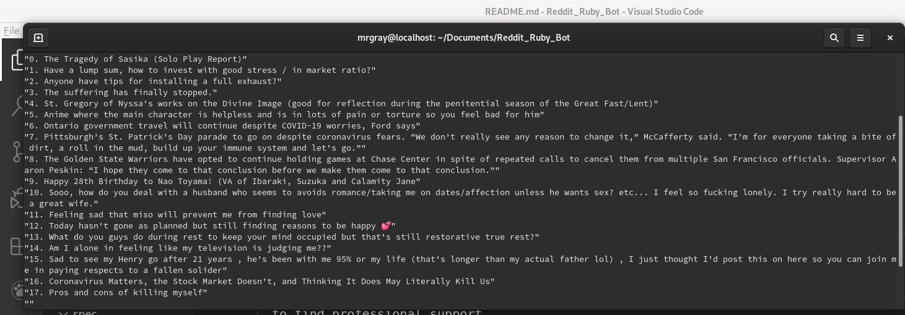

# throwaway account created for the TSE reviewers to save time
 Skip steps in Creating a custom reddit developer account
# Object oriented design with Ruby : Suicide Prevention Reddit Ruby Bot
   What problems does this program solve?
   1.Quickly search reddit for a large list of keywords not normally possible through the website
   2.There's a list of words we'll search for that have been associated with people who have suicidal thoughts
   With this program we can quickly find posts in reddit from the last hour of distressed people
   my intention for building this program is to help those suffering from depression. 
   In future updates i want to add the functionality of being able to reply to those posts directly
   with custom or pre-written up-lifting comments.

# GUIDE FOR Suicide prevention: supporting someone online

  Ask if they want to talk to you , encourage them to chat privately
  They may not be ready to open up, but knowing you are willing to listen is a big help. If they don’t want to talk to you, ask them about the support networks they currently have (friends, family, kaumātua, religious, community or cultural leaders, or professionals) and encourage them to seek out someone they trust from those networks.
  
  If they don’t know who they can talk to, suggest a Helpline they could call, or suggest they go and visit their doctor to find professional support.
  
  Remember you don’t have all the answers
  If they do want to chat, do your best to be there for them and listen, but realise that you don’t need to have all the answers. Be gentle, compassionate, and non-judgemental. Take them seriously, and let them know you care."
> 

# Creating a custom reddit developer account
Step 1: Creating an Application
Every bot needs to be registered on reddit. Some API wrappers let you skip this, but chances are, you will be heavily rate limited. Start by visiting your applications and skipping to the "developed apps" section and clicking the button to create an app. Give it a name and a description and select the script app type. If you want to create a web application, follow this guide. The text input labeled "redirect uri" is mandatory but you can just put any url in there because it doesn't really matter.

Step 2: Creating a Bot Account (optional)
If you want your bot to interact with other users on the site (like submitting posts or replying to comments), you'll need to create a bot account. Log out and click the "Log in or sign up" link at the top right. Pick a nice bot name and a secure password (a valid email is encouraged in case you forget the password).

This step is important! Go to the application you and add the bot's username as a developer for the app.

Step 3: Installing Redd
Go ahead and install Ruby if you haven't already. Most package managers have a pretty recent version of Ruby up. The latest version at the time of writing is 2.4.1. Redd supports Ruby versions 2.1.0 and up, but it's recommended to get the latest version, since I'll probably stop supporting older versions as time passes.

While you can just run gem install redd and call it a day, we're going to use Bundler like the resposible Rubyist we are.

 $ bundle install

(TSE can skip this test i have added a preconfig to save you time)
Step 4: Test Drive
inside the login.rb file make sure you update the information below if you decided to create your own reddit account.
reddit = Redd.it(
  user_agent: 'Redd:MyFancyBot:v1.2.3',
  client_id: <the code under the title of your app>,
  secret: <the app's secret>,
  username: <your bot's username>,
  password: <your bot's password>
)
For more info on the user_agent, take a look at reddit's API rules.

Now if everything went as planned, reddit should be a valid reddit session. The Session documentation lists all the things you can do from here

## Built With

- Ruby
- VSCode
- REDD api wrapper for REDDIT (https://github.com/avinashbot/redd)

To get a local copy up and running follow these simple example steps.

### Prerequisites
    - You need to have ***Ruby** installed on your machine ([Check this out](https://www.ruby-lang.org/en/documentation/installation/) for instructions on installing ruby)

    -Let's make sure bundler is installed:
     $ gem install bundler

### Usage
   1. Clone this repository
   2. Install dependencies , inside thelocal folder where you have cloned the repository, run in the terminal $ bundle install
   3. To start the program while still in the local folder, in the terminal `$ ruby app.rb` 

## Author

👤 **Dannison Arias**

- Github: [@dannisonarias](https://github.com/dannisonarias)
- Twitter: [@AriasDannison](https://twitter.com/AriasDannison)
- Linkedin: [Dannison Arias](https://www.linkedin.com/in/dannison-arias-777919190/)

## 🤝 Contributing

Contributions, issues and feature requests are welcome!

Feel free to check the [issues page](issues/).

## Show your support

Give a ⭐️ if you like this project!

## Acknowledgments

- Microverse
- The Odin Project

## 📝 License

This project is [MIT](./license.md) licensed.

  

